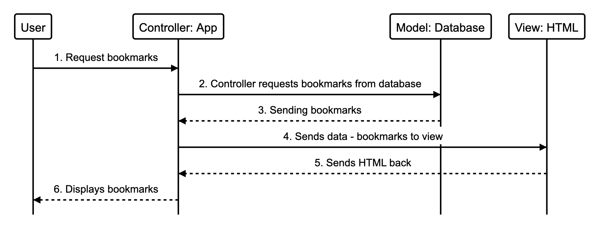

## Bookmark Manager Challenge

User story 1:

As a user,
I want to be able to see a list of my favourite websites bookmarked.
# 

Setting up the database:
* connect to `psql`
* create the database using the `psql` command `CREATE TABLE bookmark_manager;`
* connect to the database using the `psql` command `\c bookmark_manager;`
* run the query we have saved in the file `01_create_bookmarks_table.sql`

Setting up test database:
* connect to `psql`
* create the database using the `psql` command `CREATE TABLE bookmark_manager_test;`
* connect to the database using the `psql` command `\c bookmark_manager_test;`
* run the query we have saved in the file `01_create_bookmarks_table.sql`
